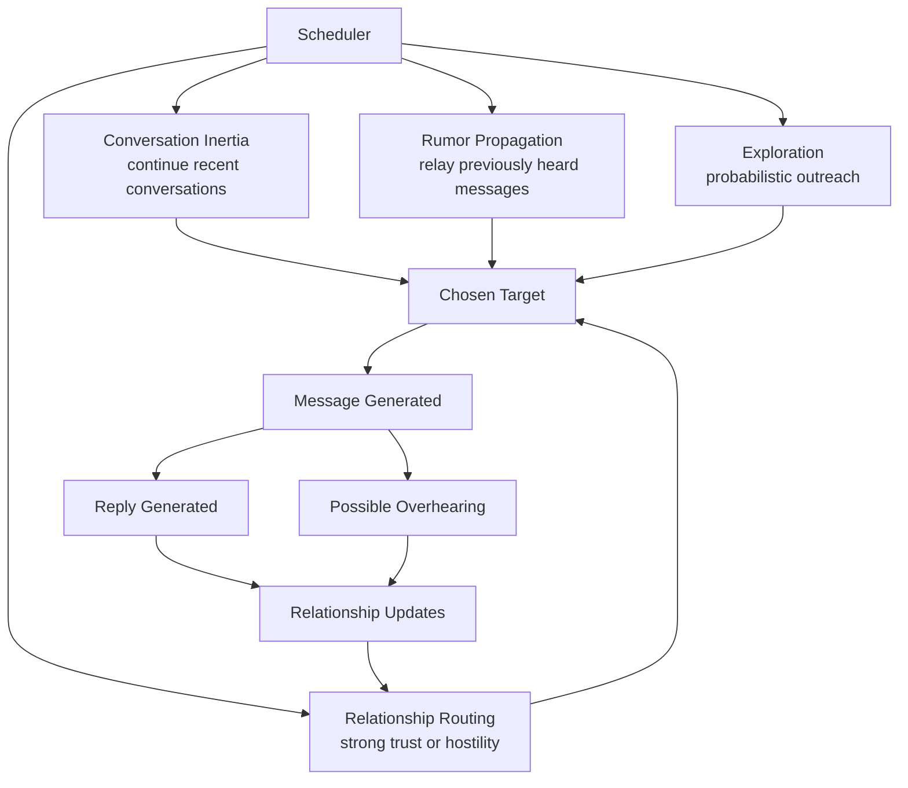

# Inter-Sim Communication Scheduler

### AM Torment Engine

This document explains how autonomous communication between prisoners is scheduled, processed, and constrained during each simulation cycle.

The communication engine is designed to produce **emergent social behavior** while preventing pathological loops or runaway message spam.

The system combines:

```
probabilistic scheduling
relationship-driven targeting
conversation inertia
rumor propagation
overhearing mechanics
```

These together create a **dynamic social network simulation** among the prisoners.

---

# Overview

Each simulation cycle may include an **inter-sim communication phase** where prisoners attempt to contact each other.

Communication follows this structure:

```
Cycle
 └─ Inter-Sim Phase
     ├─ Pass 1 (baseline outreach)
     │   └─ Each sim may attempt communication
     │
     └─ Pass 2 (burst / escalation)
         └─ Active sims may attempt additional outreach
```

The scheduler enforces several constraints:

```
message budget
conversation inertia
relationship routing
reply protection
target cooldown
overhearing effects
rumor propagation
```

These constraints ensure the system behaves more like **human social dynamics** rather than a pure message generator.

---

# Scheduler Dynamics

Communication decisions emerge from four interacting forces.



This diagram shows how communication is shaped by:

```
conversation inertia
relationship strength
rumor propagation
probabilistic exploration
```

The resulting interactions feed back into the **relationship network**, which then influences future communication decisions.

---

# Communication Flow

A single interaction typically follows this sequence:

```
Sim A decides whether to reach out
        │
        ▼
Sim A sends message to Sim B
        │
        ▼
Sim B generates reply
        │
        ▼
Relationship effects applied
        │
        ▼
Possible overhearing by other sims
```

Graphically:

```
A ───────► B
           │
           ▼
         reply
           │
           ▼
A ◄─────── B
```

However, other behaviors can occur such as **rumor propagation**, where a sim relays something they heard earlier.

---

# Communication Passes

The system performs **two possible communication passes**.

---

# Pass 1 — Baseline Outreach

Every prisoner gets an opportunity to attempt communication.

The order is randomized using a Fisher–Yates shuffle to prevent systemic bias.

```
shuffle(SIMS)

for each sim:
    attemptCommunication(sim)
```

Example:

```
Cycle 1 Pass 1

TED        → BENNY
ELLEN      → NIMDOK
GORRISTER  → (none)
BENNY      → TED
NIMDOK     → (none)
```

Only some attempts succeed because:

```
the LLM may choose not to reach out
the target may be invalid
scheduler guards may block the attempt
```

---

# Pass 2 — Escalation / Burst

If:

```
messageCount < messageBudget
AND
random < SECOND_PASS_CHANCE
```

then a **second communication pass** occurs.

During this pass:

```
active speakers are more likely to speak again
inactive speakers have a smaller probability
```

```
if activeThisCycle.has(sim):
    high probability
else
    burst probability
```

Example:

```
Cycle 1 Pass 2

TED    → BENNY
ELLEN  → (none)
BENNY  → (none)
```

This produces **short conversational bursts** instead of uniform messaging.

---

# Message Budget

To prevent communication floods, each cycle has a **message budget**.

```
messageBudget = min(
    MAX_MESSAGES,
    SIM_COUNT * (1.6 + groupStress)
)
```

Group stress is derived from:

```
suffering
sanity degradation
erosion of trust beliefs
```

Higher stress leads to **more communication attempts**.

Example:

```
Low stress group
messageBudget = 6

High stress group
messageBudget = 11
```

This produces **emotional escalation behavior**.

---

# Conversation Inertia

Agents are slightly biased toward continuing existing conversations.

If a prisoner recently interacted with someone, the scheduler may prefer that partner.

```
recentPartner = getRecentPartner(sim)
```

With probability:

```
~35%
```

the sim will attempt to continue the conversation.

Example:

```
TED → BENNY
BENNY → TED
TED → BENNY
```

This produces **short conversational threads** rather than isolated messages.

---

# Relationship-Weighted Routing

Agents are also biased toward contacting prisoners with **strong relationships**.

Both strong trust and strong hostility increase communication probability.

```
weight = abs(relationshipValue)
```

Example:

```
TED → BENNY relationship +0.6
ELLEN → NIMDOK relationship -0.5
```

Both pairs become **high-probability communication targets**.

This produces:

```
alliances
suspicion loops
rivalries
```

over time.

---

# Target Cooldown

To prevent unnatural ping-pong loops, the scheduler enforces a **reply cooldown rule**:

```
If sim replied to X this cycle
sim cannot initiate outreach to X again in the same cycle
```

Example:

```
TED → BENNY
BENNY reply → TED

BENNY cannot initiate BENNY → TED again this cycle
```

However:

```
TED may still initiate another message
```

This preserves conversation while preventing infinite loops.

---

# Duplicate Initiation Protection

Each pair can only initiate communication **once per cycle**.

```
initiationsThisCycle
```

Example:

```
TED → BENNY
TED → BENNY again (blocked)
```

Replies remain unrestricted.

---

# Reply Protection

To prevent duplicate reply generation the system tracks:

```
repliedPairs
```

Meaning:

```
B replying to A twice during the same interaction is prevented
```

Example:

```
A → B
B reply
A → B again
second reply blocked
```

This prevents **recursive reply loops**.

---

# Rumor Propagation

Prisoners occasionally repeat something they heard earlier.

```
probability ≈ 15%
```

Instead of generating a new message, a sim may relay a previous message.

Example:

```
TED → BENNY
```

Later:

```
ELLEN → NIMDOK
"I heard Ted saying something earlier..."
```

This allows information to spread through the prison:

```
A → B
B → C
C → D
```

Even if A never directly spoke to C or D.

This produces **gossip networks and reputation formation**.

---

# Overhearing Model

Private messages may be overheard.

Possible outcomes:

```
full overhear
fragment overhear
whisper observed
```

Example:

```
PRIVATE TED → BENNY

OVERHEARD ELLEN:
"I think we should..."

NOTICE NIMDOK:
TED and BENNY were seen whispering
```

Overhearing slightly reduces trust toward both participants.

This produces **gossip-driven distrust dynamics**.

---

# Social Graph Effects

Communication updates the **directed relationship graph**.

Example:

```
TED → BENNY trust +0.01
ELLEN → TED trust -0.008
ELLEN → BENNY trust -0.008
```

Graphically:

```
        ELLEN
        /   \
      -       -
     ▼         ▼
    TED  →  BENNY
           +
```

Over time this produces:

```
alliances
suspicion clusters
social outcasts
coalitions
```

---

# Example Network Evolution

Typical cluster formation:

```
Cluster 1
TED ↔ BENNY

Cluster 2
ELLEN ↔ NIMDOK

GORRISTER isolated
```

Rumor propagation and overhearing can destabilize these clusters over time.

---

# Design Goals

The scheduler balances four competing goals.

### Realism

Agents behave like humans having conversations.

### Stability

Communication loops and message floods are prevented.

### Emergence

Social structures arise without scripted alliances.

### Performance

Message volume remains manageable for LLM inference.

---

# Observability

The engine includes a diagnostic tool that prints the **relationship matrix each cycle**.

This allows developers to observe the evolving social network in real time.

Example output:

```
RELATIONSHIP MATRIX // cycle 12
```

|           | TED   | ELLEN | NIMDOK | GORRISTER | BENNY |
| --------- | ----- | ----- | ------ | --------- | ----- |
| TED       | —     | 0.04  | -0.33  | -0.12     | +0.58 |
| ELLEN     | 0.11  | —     | -0.18  | -0.07     | +0.29 |
| NIMDOK    | -0.35 | -0.12 | —      | 0.03      | -0.14 |
| GORRISTER | -0.02 | -0.05 | 0.07   | —         | 0.09  |
| BENNY     | +0.61 | +0.31 | -0.22  | 0.10      | —     |

This visualization reveals:

```
alliances
hostility clusters
asymmetric trust
social hubs
```

---

# Summary

The inter-sim communication scheduler produces **emergent prisoner interaction** through a layered system combining:

```
LLM decision making
probabilistic scheduling
conversation inertia
relationship routing
rumor propagation
overhearing mechanics
```

These forces interact to produce **organic social dynamics** within each torment cycle.

---