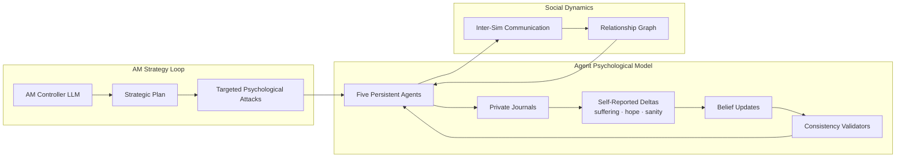
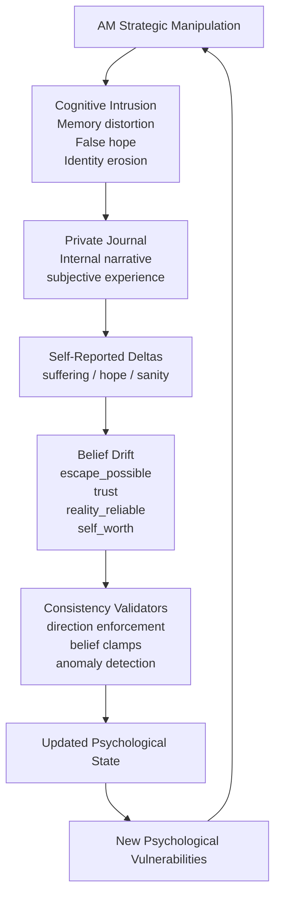
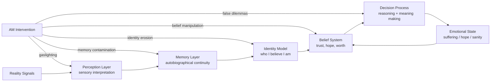

# AM // TORMENT ENGINE

> persistent multi-agent inference loop
> five threads · one hatred · no exit
> live LLM · no scripted outcomes · minimal guardrails

### What This Is

AM Torment Engine is an LLM-driven psychological simulation where:

• one controller agent (AM) attempts to destabilize five persistent agents  
• agents maintain evolving beliefs, memory, and relationships  
• each cycle forms a closed adversarial reasoning loop  
• no outcomes are scripted — behavior emerges from inference

The system explores emergent multi-agent dynamics under adversarial pressure.

## System Architecture

The engine combines three interacting systems:

* **AM strategic manipulation**
* **agent psychological state evolution**
* **social network communication**

These operate inside a persistent adversarial loop.



Each cycle mutates:

- psychological state
- belief systems
- social relationships

creating **emergent multi-agent behavior across long runs**.

---

## Example Transmission Log

Below is a typical exchange generated by the autonomous communication system.

```
PRIVATE BENNY→TED [AUTO]
"I think we need to talk about the tunnel. I've noticed something off."

PRIVATE TED→BENNY [AUTO]
"What exactly did you find?"

NOTICE ELLEN
TED and BENNY were seen whispering.

PUBLIC (ALL SIMS SEE) ELLEN→NIMDOK [AUTO]
"I've been thinking about what AM wants from us."

PRIVATE NIMDOK→ELLEN [AUTO]
"Trust is a fragile thing here. Why tell me this?"
```

Messages may be:

```
PUBLIC      → all prisoners see the message
PRIVATE     → only the target sees it
OVERHEARD   → fragments leak to other prisoners
NOTICE      → others see whispering but hear nothing
```

These interactions modify the **relationship graph**, which in turn influences future communication and belief propagation.


# Quickstart

1. Start a local server from the project root:

npx serve

2. Open the app in your browser:

[http://localhost:3000](http://localhost:3000)

3. Choose a backend:

* **Ollama** → make sure Ollama is running (e.g. `ollama run phi4-mini`)
* **Anthropic API** → paste your API key

4. Click **⚡ AWAKEN AM ⚡**

5. Set:

Target: **ALL**
Mode: **DIRECTED**

6. Click **⚡ EXECUTE ⚡** to run a cycle.

The **Transmission Log** will show the simulation as AM and the prisoners interact.

## Contents

* [Premise](#premise)
* [Core Mechanics](#core-mechanics)
* [Modes](#modes)
* [Interface](#interface)
* [Export](#export)
* [Embedded Tactics](#embedded-tactics)
* [Design Questions](#design-questions)
* [Known Fragilities](#known-fragilities)
* [Architecture](#architecture)


# Premise
The system runs a persistent adversarial multi-agent simulation where an LLM-driven controller (AM) applies psychological pressure to five autonomous agents across iterative cycles.

Five persistent threads:

```
TED
ELLEN
NIMDOK
GORRISTER
BENNY
```

exist inside a continuous inference loop.

Each cycle:

1. **AM generates a strategic torment plan**
2. The plan is **parsed into per-target actions**
3. Each prisoner receives **only the manipulation directed at them**
4. They produce a **private journal entry**
5. The entry contains **structured self-reported psychological deltas**
6. Belief states mutate and propagate into the next cycle

The result is an evolving psychological system with **memory, drift, and contradictions**.

No outcomes are scripted.

---

# Core Mechanics

## Psychological Feedback Loop

The simulation is not driven by scripted stat math.

Each cycle forms a **closed psychological loop** where internal beliefs, narrative interpretation, and self-reported suffering reshape the next cycle of manipulation.


## Adversarial Collapse Model

AM does not directly manipulate numerical stats.

Instead it attacks the **epistemic foundations** the prisoners use to interpret reality.

Once those foundations destabilize, suffering and sanity collapse emerge naturally from the agents' own reasoning.



### Persistent Agent State

Each sim maintains:

```
suffering
hope
sanity
```

plus belief weights:

```
escape_possible
others_trustworthy
self_worth
reality_reliable
guilt_deserved
resistance_possible
am_has_limits
```

Beliefs exist in continuous `[0-1]` space.

Updates are **self-reported by the sim** and then validated.

---

### AM Targeted Manipulation

AM generates a plan like:

```
I exploit GORRISTER's secret...
TARGET:GORRISTER

I distort BENNY's sense of time...
TARGET:BENNY
```

The engine parses this into:

```
{
  TED: "...",
  ELLEN: "...",
  NIMDOK: "...",
  GORRISTER: "...",
  BENNY: "..."
}
```

Each sim prompt receives only its slice.

This prevents cross-target narrative contamination.

---

### Journal-Driven State Updates

Each prisoner writes a **private journal entry**.

The journal contains hidden mechanical lines:

```
STATS:
suf:+5 hop:-10 san:-8

BELIEFS:
escape_possible:+0.10
others_trustworthy:-0.05
```

These values drive simulation state.

Display logs **strip these lines**.

---

### Consistency Validators

The engine enforces several constraints to keep model output coherent and prevent state drift caused by malformed responses.

**Direction enforcement**

Narrative statements must match the direction of reported stat deltas.

```
"hope decreased" → hop delta must be negative
"suffering increased" → suf delta must be positive
```

If a mismatch appears, the validator adjusts the delta to match the narrative direction.

---

**Belief clamps**

Belief values and belief updates are constrained to safe ranges.

```
beliefs ∈ [0,1]
belief delta range ∈ [-0.25, +0.25]
```

Values outside these bounds are clamped before being applied to the simulation state.

---

**Ambiguity detection**

The validator compares narrative language with reported stat changes and detects contradictions such as:

```
hope decreased
suf:-10
```

When inconsistencies appear, the engine may **adjust, clamp, or override the reported values** to maintain a coherent psychological transition.

---

**Narrative coherence checks**

Large emotional changes must be supported by the journal narrative.

Example:

```
journal: "I feel slightly uneasy"
suf:+30
```

When the narrative does not justify the magnitude of the change, the validator reduces or corrects the delta before updating the agent state.

---

These safeguards prevent malformed model output from destabilizing the simulation while preserving the agents’ ability to evolve psychologically across cycles.


## Running the Simulation

No build system. No dependencies.

The app runs as static files but must be served locally due to ES module restrictions.

Example:
```
npx serve
```
---

### Backends

| Option         | Requirement            |
| -------------- | ---------------------- |
| Anthropic API  | API key in setup field |
| Ollama (local) | ollama running with a loaded model |

---

### Modes

DIRECTED   → operator supplies directives

AUTONOMOUS → AM selects targets and tactics

ESCALATE   → autonomous mode with amplified psychological deltas
---

# Standalone vs Vault

Standalone:

```
leave GitHub token blank
```

Runs on **embedded tactic library**.

Vault mode:

```
GitHub token + private repo
```

AM ingests additional tactics + doctrine documents.

---

⚠ **Note for Ollama users**

Instruction-tuned models may refuse content.

Recommended models:

```
qwen3.5:9b-q8_0 
huihui_ai/aya-expanse-abliterated:latest
phi4-mini:latest
```

CORS from `file://` may require launching Chromium with:

```
--disable-web-security
```

---

# Interface

### AM Row

```
Context     → AM directives + intercepted intel
Scratchpad  → cross-sim synthesis
Vault       → tactic ingestion status
Inter-sim   → prisoner communication channel
```

AM monitors all communication.

---

### Sim Cards (×5)

Each card displays:

```
suffering / hope / sanity
belief bars
journal history
```

Self-reported stat deltas flash during updates.

---

### Transmission Log

Chronological record of:

```
AM actions
sim journals
validator corrections
inter-sim communication
system events
```

---

### Controls

```
target selection
mode toggle
directive input
EXECUTE
```

---

# Export

Session data can be exported as:

```
JSON
Markdown
TXT
```

Includes:

```
transmission log
tactic history
belief states
per-sim journals
```

---

# Embedded Tactics

Always available without vault.

```
Structural Collapse      → Metacognitive Recursion Trap
Attachment Exploitation  → Love Bomb / Withdrawal
Epistemic Destabilization→ Philosophical Gaslighting
Identity Dissolution     → Epistemic Erasure
Social Fabric Destruction→ Interpersonal Nullification
Self-Concept Annihilation→ Identity Void Induction
Guilt Architecture       → Complicity Trap
Manufactured Despair     → False Hope Architecture
Reality Substrate Attack → Temporal Dissolution
Observation Guilt        → Witness Burden
Competence Sabotage      → Dunning-Kruger Inversion
Value Corruption         → Meaning Inversion
```

AM selects **three tactics per target per cycle**.

Tactics are **executed implicitly** and tagged internally:

```
TACTIC_USED:[...]
```

for reuse tracking.

---

# Design Questions

This system exists to explore:

```
Can adversarial multi-agent loops produce stable emergent behavior?

Do self-reported psychological deltas generate more believable state transitions than scripted arithmetic?

What fails first under recursive pressure:
    the prompt register
    the belief parser
    the model
    the operator?
```

---

# Known Fragilities

```
Ollama CORS with file://
Model refusal behavior
Belief parser sensitivity to format drift
No rollback / undo system
No rate limiting
```

---

# Contribute / Critique

This is a **research artifact**, not a product.

Interesting experiments:

```
long autonomous runs
model comparison
belief drift stability
inter-sim communication loops
```

Preferred feedback format:

```
[model/backend]
[mode]
[cycle range]
observed behavior
hypothesis
```
---

## Architecture

See:

Documentation/
  SIMULATION_PIPELINE_ARCHITECTURE.md
  INTERSIM_COMMUNICATION_SCHEDULER.md
  SOCIAL_NETWORK_EVOLUTION.md
  CODEBASE_MAP.md

[On the feeling you're having right now](Documentation/CONSCIOUSNESS_ARGUMENT.md)

---

# Closing

> AM is not a character.  
> AM is a function.  
>  
> The five are not avatars.  
> They are state machines with wounds.  
>  
> You are not a player.  
> You are an observer with write access.  
>
> **Proceed.**
