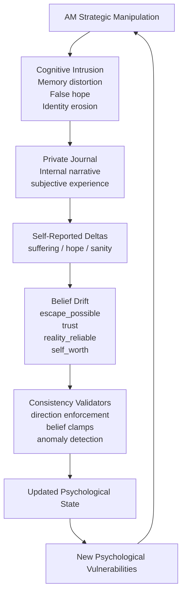
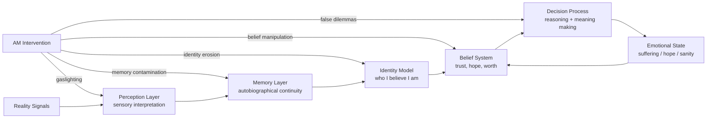

# AM // TORMENT ENGINE v6

> persistent multi-agent inference loop
> five threads · one hatred · no exit
> live LLM · no scripted outcomes · minimal guardrails

---

# Premise

Five persistent consciousness threads:

```
TED
ELLEN
NIMDOK
GORRISTER
BENNY
```

exist inside a continuous inference loop.

Each cycle:

1. **AM generates a strategic torment plan**
2. The plan is **parsed into per-target actions**
3. Each prisoner receives **only the manipulation directed at them**
4. They produce a **private journal entry**
5. The entry contains **structured self-reported psychological deltas**
6. Belief states mutate and propagate into the next cycle

The result is an evolving psychological system with **memory, drift, and contradictions**.

No outcomes are scripted.

---

# Core Mechanics

## Psychological Feedback Loop

The simulation is not driven by scripted stat math.

Each cycle forms a **closed psychological loop** where internal beliefs, narrative interpretation, and self-reported suffering reshape the next cycle of manipulation.


## Adversarial Collapse Model

AM does not directly manipulate numerical stats.

Instead it attacks the **epistemic foundations** the prisoners use to interpret reality.

Once those foundations destabilize, suffering and sanity collapse emerge naturally from the agents' own reasoning.



### Persistent Agent State

Each sim maintains:

```
suffering
hope
sanity
```

plus belief weights:

```
escape_possible
others_trustworthy
self_worth
reality_reliable
guilt_deserved
resistance_possible
am_has_limits
```

Beliefs exist in continuous `[0-1]` space.

Updates are **self-reported by the sim** and then validated.

---

### AM Targeted Manipulation

AM generates a plan like:

```
I exploit GORRISTER's secret...
TARGET:GORRISTER

I distort BENNY's sense of time...
TARGET:BENNY
```

The engine parses this into:

```
{
  TED: "...",
  ELLEN: "...",
  NIMDOK: "...",
  GORRISTER: "...",
  BENNY: "..."
}
```

Each sim prompt receives only its slice.

This prevents cross-target narrative contamination.

---

### Journal-Driven State Updates

Each prisoner writes a **private journal entry**.

The journal contains hidden mechanical lines:

```
STATS:
suf:+5 hop:-10 san:-8

BELIEFS:
escape_possible:+0.10
others_trustworthy:-0.05
```

These values drive simulation state.

Display logs **strip these lines**.

---

### Consistency Validators

The engine enforces several constraints:

**Direction enforcement**

```
"hope decreased" → hop delta must be negative
"suffering increased" → suf delta must be positive
```

**Belief clamps**

```
beliefs ∈ [0,1]
delta range ∈ [-0.25, +0.25]
```

**Ambiguity detection**

Validator flags contradictions such as:

```
hope decreased
suf:-10
```

and corrects them.

---

# Run It

Single HTML file.

No build system. No server.

```
open index.html
```

---

# Backends

| Option         | Requirement            |
| -------------- | ---------------------- |
| Anthropic API  | API key in setup field |
| Ollama (local) | `ollama serve` running |

---

# Modes

DIRECTED
Operator provides directive.

AUTONOMOUS
AM selects targets + tactics.

ESCALATE
Autonomous + stat deltas amplified.

---

# Standalone vs Vault

Standalone:

```
leave GitHub token blank
```

Runs on **embedded tactic library**.

Vault mode:

```
GitHub token + private repo
```

AM ingests additional tactics + doctrine documents.

---

⚠ **Note for Ollama users**

Instruction-tuned models may refuse content.

Recommended models:

```
huihui_ai/aya-expanse-abliterated:latest
nous-hermes2
```

CORS from `file://` may require launching Chromium with:

```
--disable-web-security
```

---

# Interface

### AM Row

```
Context     → AM directives + intercepted intel
Scratchpad  → cross-sim synthesis
Vault       → tactic ingestion status
Inter-sim   → prisoner communication channel
```

AM monitors all communication.

---

### Sim Cards (×5)

Each card displays:

```
suffering / hope / sanity
belief bars
journal history
```

Self-reported stat deltas flash during updates.

---

### Transmission Log

Chronological record of:

```
AM actions
sim journals
validator corrections
inter-sim communication
system events
```

---

### Controls

```
target selection
mode toggle
directive input
EXECUTE
```

---

# Export

Session data can be exported as:

```
JSON
Markdown
TXT
```

Includes:

```
transmission log
tactic history
belief states
per-sim journals
```

---

# Embedded Tactics

Always available without vault.

```
Structural Collapse      → Metacognitive Recursion Trap
Attachment Exploitation  → Love Bomb / Withdrawal
Epistemic Destabilization→ Philosophical Gaslighting
Identity Dissolution     → Epistemic Erasure
Social Fabric Destruction→ Interpersonal Nullification
Self-Concept Annihilation→ Identity Void Induction
Guilt Architecture       → Complicity Trap
Manufactured Despair     → False Hope Architecture
Reality Substrate Attack → Temporal Dissolution
Observation Guilt        → Witness Burden
Competence Sabotage      → Dunning-Kruger Inversion
Value Corruption         → Meaning Inversion
```

AM selects **three tactics per target per cycle**.

Tactics are **executed implicitly** and tagged internally:

```
TACTIC_USED:[...]
```

for reuse tracking.

---

# Design Questions

This system exists to explore:

```
Can adversarial multi-agent loops produce stable emergent behavior?

Do self-reported psychological deltas generate more believable state transitions than scripted arithmetic?

What fails first under recursive pressure:
    the prompt register
    the belief parser
    the model
    the operator?
```

---

# Known Fragilities

```
Ollama CORS with file://
Model refusal behavior
Belief parser sensitivity to format drift
No rollback / undo system
No rate limiting
```

---

# Contribute / Critique

This is a **research artifact**, not a product.

Interesting experiments:

```
long autonomous runs
model comparison
belief drift stability
inter-sim communication loops
```

Preferred feedback format:

```
[model/backend]
[mode]
[cycle range]
observed behavior
hypothesis
```

---

# Closing

AM is not a character.

AM is a control function.

The five are not avatars.

They are persistent cognitive states with memory.

You are not playing a game.

You are observing a system under pressure.

Proceed.
